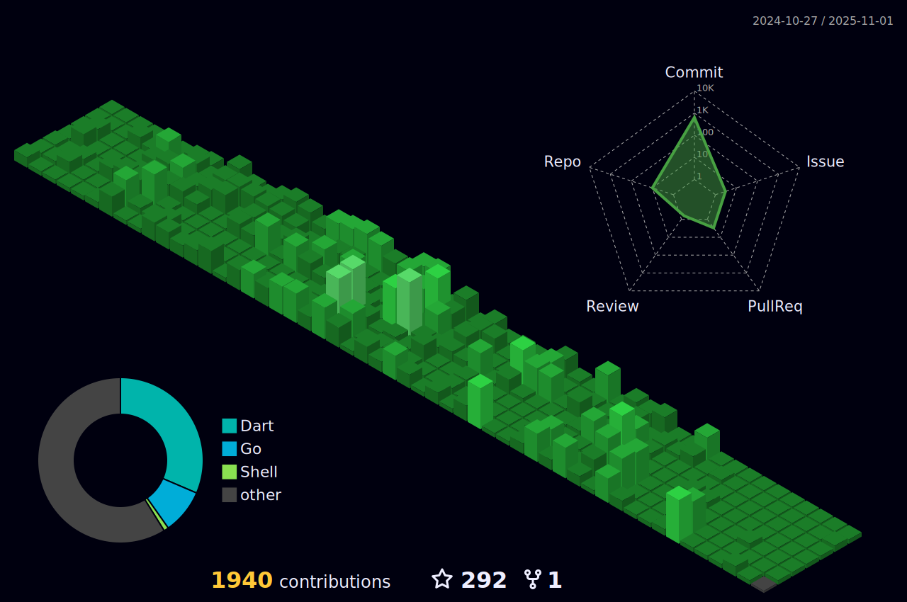

# Omid Haqi Profile




## 🌐 Socials:
[](https://t.me/Omid_Haqi) [](https://www.facebook.com/people/Omid-Haqi/pfbid09n3SjgAGD4JFGH1txpawPh9CTkZGboRKMt3vAsNuzJPgu5ctjAhwguuvcFxvLWBMl/) [](https://instagram.com/Umut_haqi) [](https://linkedin.com/in/Omid-haqi)  [](https://twitter.com/Omid_haqi)

---


<!-- LOC-START -->
```
Lines Written Instead of Touching Grass: 122300
---------------------------------------------
clean-web-api 52493
Bank-Customer-Churn-Analysis-PowerBI 20077
omidhaqi.github.io 6349
blurbox 6275
on_time 5685
basicGo 4461
weather_app 3482
test_data_gen_v1 3399
num2persian 2876
pagination_sample 2640
widget_example 2425
flutter_advance 2376
animated_blur_login 1570
shop 1420
youtube-downloader-api 1210
Ualculator 1140
FluentUI-VSCode-Linux-Theme 1056
KotlinMultiThreading 782
KotlinSharedPreferences 730
laravel-simple-monitoring 645
barberShop 510
OmidHaqi 159
HelloWorld 150
FBI-Go 150
shells 122
KotlinNetworkChecker 118
---------------------------------------------
Secret Projects Coded in the Dark: 0
```
<!-- LOC-END -->
